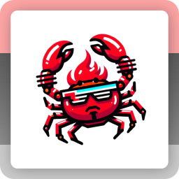

  

<h1 align="center"><b>PANKKIVAHVA</b></h1>

  <i>An application to improve my skills in the Rust language.</i>

---

## Technologies

### [🦀 Rust](https://www.rust-lang.org)

Along with:

- [Axum](https://https://github.com/tokio-rs/axum)
- [Chrono](https://github.com/chronotope/chrono)
- [Docker](https://www.docker.com)
- [Docker Compose](https://docs.docker.com/compose)
- [Postgres](https://www.postgresql.org)
- [Serde](https://github.com/serde-rs/serde)
- [SQLx](https://github.com/launchbadge/sqlx)
- [Tokio](https://github.com/tokio-rs/tokio)

## The name

> Pankki: The Finnish word for "bank".

> Vahva: From Finnish as well, meaning "strong".
